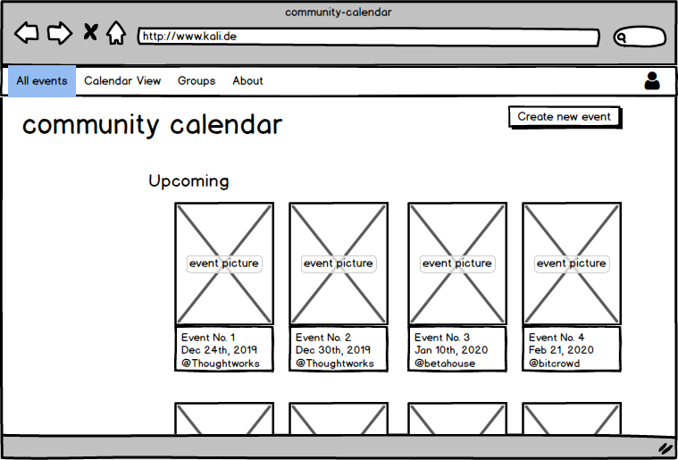
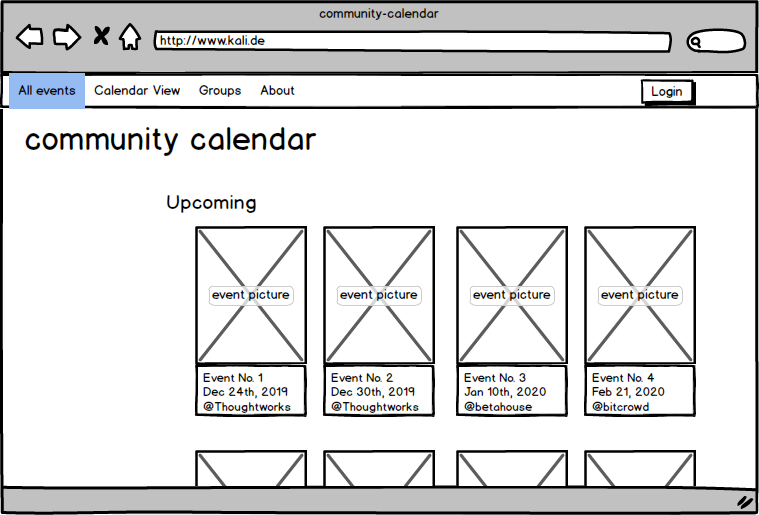
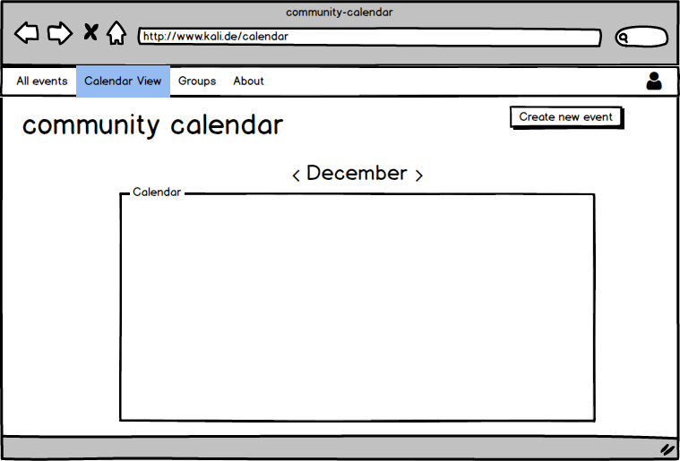

# \*kali

*This is an open source project that was started in 2019 by the [code curious](https://www.codecurious.org) study group "Ruby Stars".* 

\*kali is a calendar application for berlin-based groups of women* who learn how to code. As a platform it gathers all events of those groups, in order to build a stronger community and increase their visibility. Every group can create an account and post their events so that everyone interested can browse through them.

...At least, thats the plan :) Under <b>First Mockups</b> and <b>Minimum Viable Product</b> below you can see how we imagine the calender to be. For that, we need your help. If you want to contribute to our project, go for it and check out our [guidelines](CONTRIBUTORS.md).

If you want to check-out the current state of \*kali, follow our set-up guide below.

## Set-up Guide

<b>1. How to have a look at our code and run the kali-calender in your browser</b>

- in your terminal/console, clone the repository:
```
$ git clone git@github.com:kalicalendar/community-calendar.git
``` 
- install Bundler (if you don't have it already):
```
$  gem install bundler
```
- install the gems:
```
$ bundle install
```
- create the database:
```
$ bundle exec rake db:create
```
- run the database migrations:
```
$ bundle exec rake db:migrate
```
- run the database seeds:
```
$ bundle exec rake db:seed # this will create initial profiles that are listed in the db/seed.rb
```
- run the app:
```
$ bundle exec rails s
```

- you should see:
```
=> Booting Puma
=> Rails 5.2.3 application starting in development 
=> Run `rails server -h` for more startup options
Puma starting in single mode...
* Version 3.12.1 (ruby 2.6.2-p47), codename: Llamas in Pajamas
* Min threads: 5, max threads: 5
* Environment: development
* Listening on tcp://localhost:3000
Use Ctrl-C to stop
```

- copy-paste `localhost:3000` into your browser address bar. You should see our kali-calender website! 


## First Mockups
This is our first (rough) visual idea of the app. <br><br>
View of all events when logged in:

 
<br><br>

View of all events when logged out:

<br><br>

View of calendar page when logged in:



## Minimum Viable Product (MVP) </br>

### 1st Version:

1) see a monthly calendar with all the events added. 

2) create events with the following characteristics: date, time, title, description.

3) edit created events.

4) delete events.
    
5) click on the events from the calendar and see the information.

### 2nd Version:

1) add location, tags, "hosted by" to the events basic info.

2) create a profile for the organization with the following characteristics: name of the organization, short description, link to the website, a picture.

3) edit the profiles.

4) delete the profiles.

5) users of the calendar can read organization profiles. 

6) [add the organizations as admin manually instead of setting up a whole log-in-system.]???

### 3rd Version

1) distinguish between the different organizations by different colours.

2) filter by organization and type of event.

3) add type of event, max. number of participants, public or private event to the event basic info.

4) weekly and year view of the calendar.

5) organizations profiles show list of events added by the organization.

6) search for events by tags.

...and again, if you want to contribute, go [here](CONTRIBUTORS.md).
